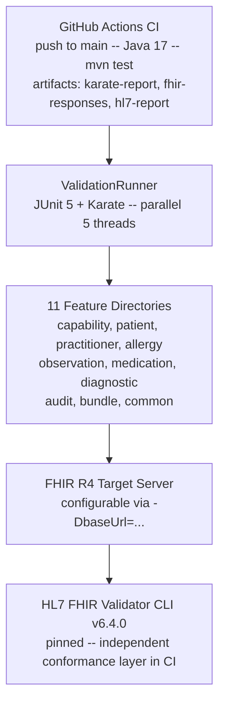

# FHIR R4 API Validation Suite

> Regulatory-grade automated API validation framework for HL7 FHIR R4.
> Built to IEC 62304 Class C with a complete IQ/OQ/PQ qualification
> lifecycle, bidirectional requirements traceability, and GitHub Actions CI.

[](https://github.com/Dag86/fhir-validation-suite/actions/workflows/fhir-validation.yml)


---

## Table of Contents

- [For Regulatory Affairs and Healthcare QA](#for-regulatory-affairs-and-healthcare-qa)
- [For Engineers and Technical Reviewers](#for-engineers-and-technical-reviewers)
- [Quick Start](#quick-start)
- [Multi-Server Conformance Results](#multi-server-conformance-results)
- [Project Structure](#project-structure)
- [Validation Document Package](#validation-document-package)
- [Regulatory Standards](#regulatory-standards)
- [Built By](#built-by)

---

## For Regulatory Affairs and Healthcare QA

This project demonstrates a complete FDA-regulated software validation
lifecycle applied to a custom automated test framework -> the kind of
rigor required for tools used to generate evidence in clinical trials,
medical device development, and healthcare software quality systems.

### What Was Validated

The suite is classified as **IEC 62304 Class C** based on credible
patient harm paths across five FHIR resource types:

| Resource | Patient Harm Path |
|---|---|
| AllergyIntolerance | Missed allergy -> contraindicated medication administered |
| MedicationRequest | Incorrect dose or drug -> patient harm |
| Observation | Incorrect lab result -> wrong clinical decision |
| Patient | Identity mismatch -> treatment delivered to wrong patient |
| DiagnosticReport | Missed or incorrect finding -> delayed or wrong treatment |

Class C drove the full documentation rigor: bidirectional requirements
traceability, ISO 14971 risk linkage, exhaustive boundary and negative
test coverage, and SOUP documentation throughout.

### Validation Lifecycle

| Phase | Document | Version | Status |
|---|---|---|---|
| Planning | Validation Plan (VP-FHIR-001) | 1.2 | Approved |
| Requirements | Requirements Specification (RS-FHIR-001) | 1.2 | Approved -> 61 requirements |
| Architecture | Architecture Document (AD-FHIR-001) | 1.1 | Approved |
| Testing | Test Plan (TP-FHIR-001) | 1.3 | Approved -> 77 TCs |
| Traceability | Traceability Matrix (TM-FHIR-001) | 1.3 | Executed -> 100% coverage |
| Installation | IQ (TQ-FHIR-IQ-001) | 1.3 | **PASS** |
| Operation | OQ (TQ-FHIR-OQ-001) | 1.2 | **PASS** |
| Performance | PQ (TQ-FHIR-PQ-001) | 1.3 | **PASS** |
| Coverage | Gap Analysis (GA-FHIR-001) | 1.0 | Final -> 0 gaps |
| Closure | Validation Summary Report (VA-FHIR-001) | 1.1 | **VALIDATED** |

All documents live in [`docs/`](docs/) and are versioned under
21 CFR Part 820.40 document control requirements.

### Traceability Chain

```
RS-FHIR-001 (61 requirements)
    -> TP-FHIR-001 (77 test cases)
        -> Feature files (74 automated scenarios)
            -> CI Run #3 (GitHub Actions execution evidence)
                -> Commit SHA 4458f7dd (immutable audit anchor)
```

- Forward coverage (requirement -> test): 100% -> 61/61 requirements covered
- Backward coverage (test -> requirement): 100% -> 77/77 TCs mapped
- Orphaned requirements: 0
- Orphaned test cases: 0

### Negative Controls

The OQ execution included three negative controls to verify the
framework correctly detects failures -> a requirement under GAMP 5 section10.3
and FDA General Principles of Software Validation section4.5. A suite that
only produces green results is not a validated detection system.

| Control | Purpose | Result |
|---|---|---|
| Known false assertion (1 == 2) | Karate detects equality failure | PASS -> FAIL correctly reported |
| Schema match with missing field | Karate detects schema violation | PASS -> FAIL correctly reported |
| Non-conformant FHIR resource | HL7 Validator detects errors | PASS -> errors correctly flagged |

---

## For Engineers and Technical Reviewers

### Architecture



### Test Design Patterns

**B|C Background pattern** -> each feature file's `Background` performs
a live search (`GET /{Resource}?_count=1`) to extract a real resource ID
from the target server. All subsequent scenarios in the file operate on
that resource. No hardcoded IDs -> the suite works against any FHIR R4
server with data.

**Negative test coverage** -> every resource type has dedicated negative
TCs: 404 on nonexistent IDs, 400 on malformed payloads, OperationOutcome
structure validation. The suite detects non-conformance, not just
conformance.

**Conditional guards vs. hard assertions** -> a deliberate distinction:
- Hard assertion: resource field must be present regardless of server
  state (e.g. `patient` on AllergyIntolerance -> absence is a conformance
  failure)
- Conditional guard: resource type may not exist on the target server
  (e.g. AuditEvent -> absence is environmental, not a conformance failure)

**Response capture** -> key responses are written to `target/responses/`
via `karate.write()` and scanned by the HL7 Validator CLI in CI,
producing a `fhir-validation-report.json` Bundle of OperationOutcome
resources -> one per scanned file.

### Key Technical Decisions

| Decision | Rationale |
|---|---|
| Karate DSL over Postman/Newman | Native schema matching, Java interop, assertion DSL suited to regulatory-grade suites |
| FHIR R4 over R5 | ONC 21st Century Cures Act and CMS Interoperability Rule mandate R4 in production |
| HL7 Validator pinned to 6.4.0 | Floating version is a change control violation in regulated context |
| `classpath:oq` excluded from `ALL_PATHS` | OQ qualifies the test framework itself -> merging into the main runner corrupts IQ/OQ/PQ evidence separation |
| `request {}` in OperationOutcome tests | Empty body fails at FHIR parse layer (HAPI-1843) guaranteeing a 400 with a validation-specific OperationOutcome -> a body with `resourceType: Patient` reaches the database and returns 412 |
| `fhirVersion` regex match | Accepts `4.0.0` and `4.0.1` -> hardcoding a patch version breaks portability across valid R4 servers |

### Running the Suite

**Prerequisites:** Java 17 Temurin, Apache Maven 3.9.x

```bash
# Clone
git clone https://github.com/Dag86/fhir-validation-suite.git
cd fhir-validation-suite

# Run against HAPI FHIR sandbox (default)
mvn test

# Run against any FHIR R4 server
mvn test -DbaseUrl=https://your.fhir.server/baseR4

# Run against SMART Health IT sandbox
mvn test -DbaseUrl=https://launch.smarthealthit.org/v/r4/fhir

# Run OQ qualification suite only
mvn test -Dkarate.options="classpath:oq"
```

Reports: `target/karate-reports/karate-summary.html`

---

## Quick Start

```bash
git clone https://github.com/Dag86/fhir-validation-suite.git
cd fhir-validation-suite
mvn test
```

Expected:

```
scenarios:   74 | passed:    74 | failed: 0
BUILD SUCCESS
Total time:  ~02:10 min
```

---

## Multi-Server Conformance Results

| Server | URL | Result | Notes |
|---|---|---|---|
| HAPI FHIR sandbox | `hapi.fhir.org/baseR4` | **74/74 PASS** | Primary validation target |
| SMART Health IT | `launch.smarthealthit.org/v/r4/fhir` | **73/74** | TC-BUN-002 correctly flags `_total` non-compliance |

TC-BUN-002 failure on SMART Health IT is a **correct conformance
finding** -> the server ignores `_total=accurate` and omits `total` from
searchset Bundle responses. This is the suite working as designed:
differentiating compliant from partially compliant server behavior.

---

## Project Structure

```
fhir-validation-suite/
--- src/test/java/fhir/
|   --- ValidationRunner.java         # JUnit 5 entry point
--- src/test/resources/
|   --- karate-config.js              # Configurable baseUrl, fhirVersion, authToken
|   --- capability/                   # TC-CAP-001 to 003
|   --- patient/                      # TC-PAT-001 to 011
|   --- practitioner/                 # TC-PRA-001 to 006
|   --- allergy/                      # TC-ALG-001 to 008
|   --- observation/                  # TC-OBS-001 to 009
|   --- medication/                   # TC-MED-001 to 010
|   --- diagnostic/                   # TC-DXR-001 to 007
|   --- audit/                        # TC-AUD-001 to 007
|   --- bundle/                       # TC-BUN-001 to 007
|   --- common/                       # TC-OO-001 to 005, TC-GEN-001
|   --- oq/                           # OQ qualification scenarios (5)
--- docs/
|   --- validation-plan.md            # VP-FHIR-001
|   --- requirements-specification.md # RS-FHIR-001
|   --- architecture.md               # AD-FHIR-001
|   --- test-plan.md                  # TP-FHIR-001
|   --- traceability-matrix.md        # TM-FHIR-001
|   --- gap-analysis.md               # GA-FHIR-001
|   --- validation-summary-report.md  # VA-FHIR-001
|   --- qualification/
|       --- IQ.md                     # TQ-FHIR-IQ-001
|       --- OQ.md                     # TQ-FHIR-OQ-001
|       --- PQ.md                     # TQ-FHIR-PQ-001
--- .github/workflows/
|   --- fhir-validation.yml           # CI pipeline
--- CLAUDE.md                         # Project context for AI-assisted development
--- pom.xml
```

---

## Validation Document Package

| Document | Purpose |
|---|---|
| [Validation Plan](docs/validation-plan.md) | Scope, approach, risk classification, acceptance criteria |
| [Requirements Specification](docs/requirements-specification.md) | 61 functional and non-functional requirements |
| [Architecture Document](docs/architecture.md) | System design, component relationships, SOUP inventory |
| [Test Plan](docs/test-plan.md) | 77 test cases with risk linkage and coverage rationale |
| [Traceability Matrix](docs/traceability-matrix.md) | Bidirectional requirements -> test case mapping |
| [IQ](docs/qualification/IQ.md) | Installation qualification -> toolchain verification |
| [OQ](docs/qualification/OQ.md) | Operational qualification -> negative control evidence |
| [PQ](docs/qualification/PQ.md) | Performance qualification -> end-to-end execution evidence |
| [Gap Analysis](docs/gap-analysis.md) | Coverage analysis -> 0 gaps confirmed |
| [Validation Summary Report](docs/validation-summary-report.md) | Formal closure -> suite declared VALIDATED |

---

## Regulatory Standards

| Standard | Application |
|---|---|
| IEC 62304 | Software lifecycle -> Class C classification |
| ISO 14971 | Risk management -> hazard analysis and risk controls |
| 21 CFR Part 11 | Electronic records and audit trail requirements |
| 21 CFR Part 820 / QMSR | Quality system -> document control per section820.40 |
| GAMP 5 Category 5 | Custom software -> full CSV lifecycle |
| FDA General Principles of Software Validation (2002) | Validation methodology |
| FDA Computer Software Assurance (2022) | Risk-based validation approach |
| ONC 21st Century Cures Act | FHIR R4 mandate -> rationale for R4 over R5 |
| CMS Interoperability Rule | FHIR R4 production adoption basis |

---

## Built By

**Amir Choshov** -> SDET with 8+ years in regulated software, transitioning
into healthcare and medical device QA. Background includes 21 CFR Part 11
compliance on clinical trials platforms.

[LinkedIn](https://www.linkedin.com/in/amirchoshov)  | 
[GitHub](https://github.com/Dag86)

---

*Validation evidence is anchored to commit
[`de3c025`](https://github.com/Dag86/fhir-validation-suite/commit/de3c0255187dfb5efe7a348518b0d360aafd95e3).
All CI artifacts are archived in
[GitHub Actions](https://github.com/Dag86/fhir-validation-suite/actions).*
