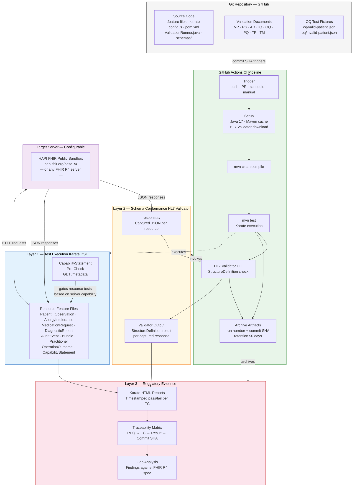

# System Architecture

## FHIR R4 API Validation Suite

**Document reference:** AD-FHIR-001 Section 2

---

---

## Component Roles

| Component | Role | Regulatory Significance |
|---|---|---|
| Git Repository | Source control, document versioning, change audit trail | 21 CFR Part 820.40 — document control |
| GitHub Actions | Automated test execution and evidence archiving | 21 CFR Part 820 — repeatable, documented verification |
| Karate DSL | Layer 1 clinical assertions against FHIR specification | Primary test execution evidence |
| CapabilityStatement Pre-Check | Server capability discovery — gates all subsequent tests | Prevents false failures on unsupported resources |
| FHIR R4 Server | Target under validation — configurable via single parameter | Any server can be targeted without code changes |
| HL7 Validator CLI | Layer 2 authoritative StructureDefinition conformance | Specification-authoritative evidence distinct from Karate |
| Archived Artifacts | Timestamped reports linked to Git commit SHA | REQ-GEN-006 — traceability chain |
| Traceability Matrix | Bidirectional REQ ↔ TC ↔ result mapping | IEC 62304 Class C — bidirectional traceability required |
