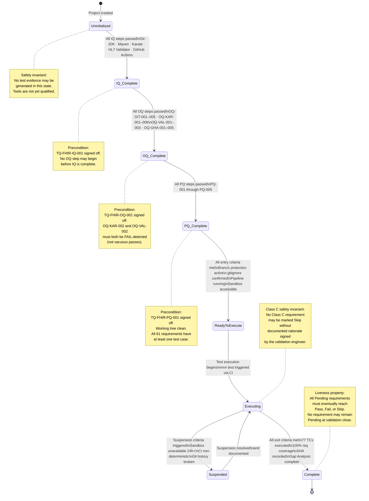

# Validation State Machine
## FHIR R4 API Validation Suite

**Document reference:** VP-FHIR-001 Section 5.2

This diagram applies the TLA+ state machine approach to the validation lifecycle. Each state transition has explicit preconditions. Safety properties and liveness properties are annotated.

---

---

## State Definitions

| State | Entry Condition | Exit Condition |
|---|---|---|
| Uninitialized | Project created | All IQ steps pass |
| IQ_Complete | TQ-FHIR-IQ-001 passed | All OQ steps pass |
| OQ_Complete | TQ-FHIR-OQ-001 passed | All PQ steps pass |
| PQ_Complete | TQ-FHIR-PQ-001 passed | All VP entry criteria met |
| ReadyToExecute | VP-FHIR-001 Section 7.1 satisfied | `mvn test` executed in CI |
| Executing | Test run triggered | All exit criteria satisfied or suspension triggered |
| Suspended | Suspension criteria triggered | Criteria resolved and documented |
| Complete | VP-FHIR-001 Section 7.2 satisfied | Validation package closed |

## Safety Properties (Must Hold in All States)

- No test execution evidence is valid before PQ_Complete
- No Class C requirement may remain uncovered at Complete
- Git history on `main` must never be rebased or force-pushed — breaks evidence chain
- OQ-KAR-002 must have confirmed that Karate correctly reports failures before Executing

## Liveness Property

The system must eventually reach Complete given sufficient time and absence of permanent suspension. All 61 requirements must reach a terminal result state (Pass, Fail, Skip) before the validation lifecycle closes.
