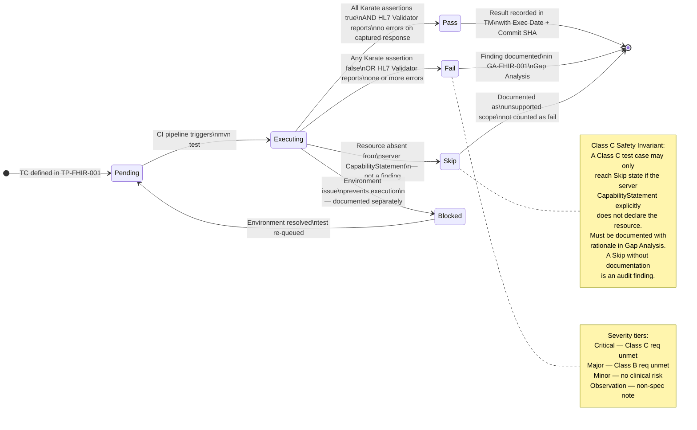

# Test Case Lifecycle
## FHIR R4 API Validation Suite

**Document reference:** TP-FHIR-001 Section 7

---



---

## Result Definitions

| Result | Criteria | Counted in Coverage? | Required Action |
|---|---|---|---|
| **Pass** | All Karate assertions true AND HL7 Validator clean | Yes | Record in TM with SHA |
| **Fail** | Any assertion false OR Validator error | Yes | Document in Gap Analysis |
| **Skip** | Resource not in CapabilityStatement | Yes — with rationale | Document rationale |
| **Blocked** | Environment issue — not a test failure | No | Resolve and re-execute |

## Two-Layer Pass Requirement

A test case reaches **Pass** only when both layers agree:

```
Layer 1: Karate assertion    → PASS
Layer 2: HL7 Validator       → No errors
                               ─────────
                               TC Result: PASS
```

If Karate passes but HL7 Validator flags errors — or vice versa — the test case result is **Fail**. The discrepancy is itself a finding worth documenting: it means Karate's clinical assertions and the authoritative specification diverge on that resource.

## Traceability Requirement

Every terminal result (Pass, Fail, Skip) must be recorded in TM-FHIR-001 with:
- Execution date
- Git commit SHA of the run (per REQ-GEN-006)
- GitHub Actions run number

A result without a commit SHA is not valid regulated evidence.
