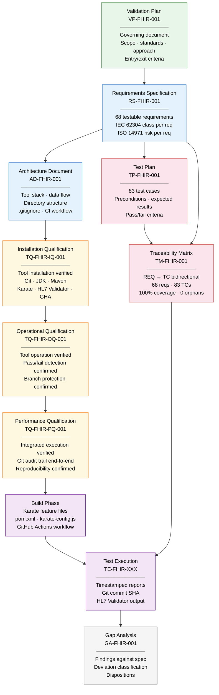

# Document Dependency Chain

## FHIR R4 API Validation Suite

**Document reference:** VP-FHIR-001 Section 8

The dependency chain defines the required authoring order. A document may not be written before the documents it depends on are complete. This sequencing is not bureaucratic — each downstream document derives its content from upstream documents, so they must exist first.

---

---

## Why This Order Matters

| Dependency | Reason |
|---|---|
| VP before RS | RS scope is defined by VP scope — a requirement outside VP scope is invalid |
| RS before TP | Test cases must trace to requirements — you cannot write TCs before requirements exist |
| RS before AD | Architecture decisions must account for all resource types in scope |
| AD before IQ | IQ verifies what AD specifies — tool versions, paths, directory structure |
| IQ before OQ | OQ tests tool operation — tools must be installed before operation is tested |
| OQ before PQ | PQ tests integrated performance — individual tools must be qualified first |
| PQ before Build | No test evidence is valid until the toolchain is qualified |
| TP + RS before TM | TM links requirements to test cases — both must exist first |
| TM before TE | Test execution results populate the TM — the matrix must exist first |
| TE before GA | Gap analysis documents findings from execution — execution must happen first |
