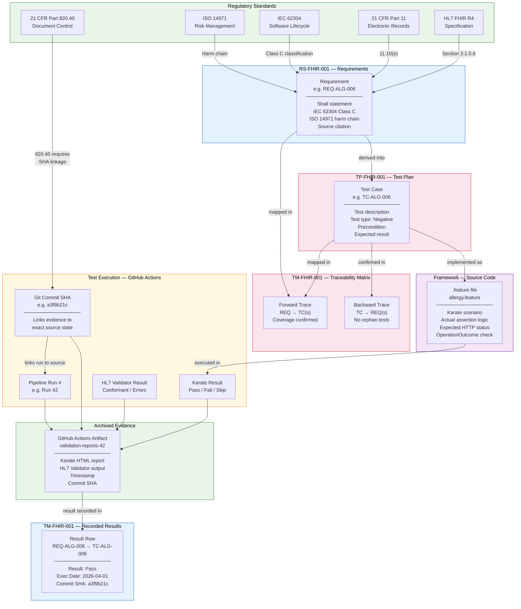

# Regulatory Traceability Flow
## FHIR R4 API Validation Suite

**Document reference:** TM-FHIR-001 Section 1, REQ-GEN-006, REQ-GEN-007

This diagram shows the complete traceability chain — from the regulatory standard that drives a requirement, through to the archived evidence that proves it was tested. Every link in this chain is auditable and version-controlled.

---

---

## Why Every Link Matters

| Link | What Breaks If Missing |
|---|---|
| Standard → Requirement | Requirement has no regulatory basis — auditor will ask "why does this requirement exist?" |
| Requirement → Test Case | Requirement is untested — coverage gap finding |
| Test Case → Requirement | Orphan test — test exists without regulatory rationale |
| Test Case → Feature File | Requirement defined but never implemented |
| Feature File → Execution | Implementation never run — no evidence |
| Execution → Commit SHA | Evidence cannot be reproduced — which code version was tested? |
| SHA → Artifact | Evidence not archived — not retrievable for audit |
| Artifact → TM Result Row | Execution happened but result never recorded — matrix incomplete |

## The Audit Question This Chain Answers

An FDA auditor's core question: *"Show me that requirement X was tested, that the test passed, and that you can reproduce that result."*

This chain answers all three parts:
1. **Requirement X was tested** — TM forward trace shows TC-X maps to REQ-X
2. **The test passed** — TM result row shows Pass on a specific date
3. **You can reproduce it** — Git commit SHA identifies the exact code state; `git checkout {SHA}` and `mvn test` reproduces the run
