```mermaid
flowchart TD
    subgraph CLASSC["IEC 62304 Class C — Serious Injury or Death Possible"]
        direction TB

        subgraph HIGHEST["Highest Clinical Risk"]
            ALG["AllergyIntolerance\n──────────────────\nFailure path:\nMissing/malformed allergy record\n→ contraindicated substance given\n→ anaphylaxis / death\n──────────────────\n6 requirements · 8 test cases"]
        end

        subgraph HIGH["High Clinical Risk"]
            MED["MedicationRequest\n──────────────────\nFailure path:\nWrong drug · wrong dose · wrong patient\n→ adverse drug event / death\n──────────────────\n7 requirements · 10 test cases"]

            OBS["Observation\n──────────────────\nFailure path:\nWrong lab value · missing unit\n→ incorrect dosing / missed diagnosis\n──────────────────\n7 requirements · 9 test cases"]

            DXR["DiagnosticReport\n──────────────────\nFailure path:\nPreliminary report treated as final\n→ premature discharge / wrong treatment\n──────────────────\n5 requirements · 7 test cases"]
        end

        subgraph IDENTITY["Identity — Never Event Risk"]
            PAT["Patient\n──────────────────\nFailure path:\nWrong patient selected\n→ wrong treatment / wrong surgery\n(classified as Never Event)\n──────────────────\n13 requirements · 14 test cases"]
        end

        subgraph ATOMIC["Atomicity — Data Integrity"]
            BUN_C["Bundle transaction atomicity\nREQ-BUN-005\n──────────────────\nFailure path:\nPartial write creates\nincomplete clinical record\n──────────────────\n1 requirement · 1 test case"]
        end
    end

    subgraph CLASSB["IEC 62304 Class B — Non-Serious Injury Possible"]
        direction TB

        subgraph COMPLIANCE["Compliance Infrastructure"]
            AUD["AuditEvent\n──────────────────\n21 CFR Part 11 anchor\nWho accessed what and when\nRegulatory audit trail\n──────────────────\n5 requirements · 7 test cases"]
        end

        subgraph ERRORS["Error Handling"]
            OO["OperationOutcome\n──────────────────\nAll negative path tests\ndepend on this structure\nNon-compliant errors break\nFHIR client integrations\n──────────────────\n4 requirements · 5 test cases"]
        end

        subgraph INTEROP["Interoperability"]
            BUN_B["Bundle searchset\n──────────────────\nSearch result structure\nReal FHIR transactions\nuse Bundle not single resources\n──────────────────\n5 requirements · 7 test cases"]

            PRA["Practitioner\n──────────────────\nProvider attribution\nOrder traceability\n──────────────────\n3 requirements · 6 test cases"]

            PRE["CapabilityStatement\n──────────────────\nServer self-description\nGates all resource tests\n(REQ-PRE-001 through PRE-003)\n──────────────────\n3 requirements · 3 test cases"]
        end

        subgraph GENERAL["General Framework"]
            GEN["General Requirements\nREQ-GEN-001 through 008\n──────────────────\nHL7 Validator · meta fields\nmalformed JSON · base URL\nGit SHA · branch protection\n──────────────────\n9 requirements · 4 dedicated TCs\n(REQ-GEN-001–003, REQ-GEN-008\ncross-cutting coverage — see TM §4)"]
        end
    end

    HIGHEST -->|"Also Class C: direct harm path\nif allergy record is missing\nwhen medication is ordered"| MED

    style CLASSC fill:#fce4ec,stroke:#c62828,color:#000
    style CLASSB fill:#e3f2fd,stroke:#1565c0,color:#000
    style HIGHEST fill:#ffcdd2,stroke:#b71c1c,color:#000
    style HIGH fill:#ffebee,stroke:#c62828,color:#000
    style IDENTITY fill:#ffebee,stroke:#c62828,color:#000
    style ATOMIC fill:#ffebee,stroke:#c62828,color:#000
    style COMPLIANCE fill:#e8eaf6,stroke:#283593,color:#000
    style ERRORS fill:#e8eaf6,stroke:#283593,color:#000
    style INTEROP fill:#e8f5e9,stroke:#1b5e20,color:#000
    style GENERAL fill:#f5f5f5,stroke:#616161,color:#000
```

# Risk Classification Hierarchy

## FHIR R4 API Validation Suite

**Document reference:** RS-FHIR-001 Section 3.1, VP-FHIR-001 Section 3.3

Resources are classified by the severity of harm that a validation failure could cause, per IEC 62304 and ISO 14971. Classification drives test coverage depth — Class C receives full positive, negative, boundary, audit, and schema coverage. Class B receives positive and critical negative coverage.

---



---

## Coverage Requirements by Class

| Class | Resources | Positive | Negative | Boundary | Schema | Audit |
|---|---|---|---|---|---|---|
| **Class C** | AllergyIntolerance, MedicationRequest, Observation, DiagnosticReport, Patient, BUN-005 | ✅ | ✅ Full | ✅ | ✅ | ✅ |
| **Class B** | AuditEvent, OperationOutcome, Bundle (search), Practitioner, CapabilityStatement | ✅ | ✅ Critical only | — | ✅ | ✅ |

## Test Execution Sequence Rationale

AllergyIntolerance executes first among clinical resources because it carries the highest patient safety risk — the allergy-to-medication harm chain is the most direct path from data error to patient death. The execution sequence is not alphabetical — it is risk-ordered.

```text
1. CapabilityStatement (gates everything)
2. OperationOutcome (required by all negative path tests)
3. Patient (identity — all other resources reference it)
4. Practitioner
5. AllergyIntolerance ← highest risk first
6. Observation
7. MedicationRequest
8. DiagnosticReport
9. AuditEvent
10. Bundle
```
